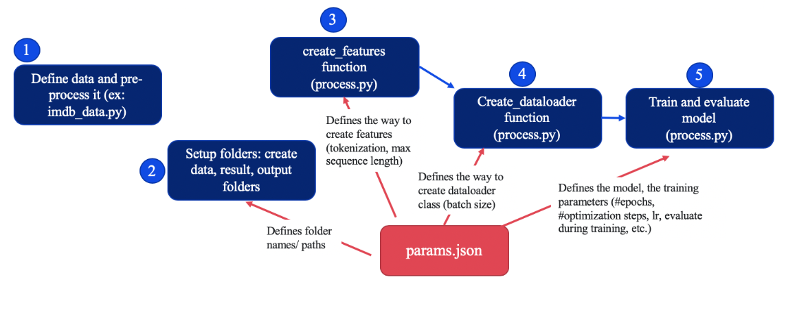

# Language models

**Table of Contents**

[TOC]


This repository is adapted from the officiel [Pytorch-Transformers](https://github.com/huggingface/pytorch-transformers) library by HuggingFace.

The code can be used for the following models: bert, xlnet, xlm, roberta.

Once the data is defined and placed in the ``data/`` directory in the required format 
(train.tsv, evaluation.tsv with "text" and "label" columns, optionally a val.tsv (for evaluation during training with "text" and "label" columns) and a test.tsv with the "text" column, see `imdb_data.py`` for more info), create a dictionary containing all training parameters. 


 When the code is ran from the REPL, the dictionary containing the model parameters needs to be dumped as a json, and given as an input for all scripts. 


Once the data and the ``params.json`` is defined, the same steps (functions) needs to be applied to all models. 
First, create the InputFeatures from the data, next create a DataLoader class (for the train and evaluation data separately), then define the model and train it on the DataLoader classes. 
All these steps use the same dictionary, containing parameters such as the model type (ex. "bert", "xlnet", etc.), the exact name of the model (ex. "bert-base-cased", etc. See [Pretrained Models](#pretrained-models)), the corresponding tokenizer, the way to organize the data (maximum sequence length, batch size, etc) training parameters (learning rate, etc).



> Schema of the code steps.


This dictionary defines the model and it is the only difference between the different models. 


# Setup

## Installation

Create a new virtual environment and install packages.

```
conda create -n transformers python pandas tqdm jupyter
conda activate transformers
```
If using cuda:
```
conda install pytorch cudatoolkit=10.0 -c pytorch
```

else:
```
conda install pytorch cpuonly -c pytorch
```
Next, install packages:

```
conda install -c anaconda scipy
conda install -c anaconda scikit-learn
pip install pytorch-transformers
pip install tensorboardX
pip install wget
```

Run the setup.py in the main directory. This will ensure that the `modules`` scripts can be importer from everywhere in the project. 

```
python3 setup.py
```
## Define a dictionary containing all model and environmental parameters 
Example of creating a parameter dictionary for bert classification: 

```
python3 modules/create_params_example.py
```
See the ```create_params_example/py``` for the description of each key. The final dictionary has to be something like: 
```
params = {
        'data_dir': 'data/',                              # Directory of train.tsv, evaluation.tsv and test.tsv (optional)
        'params_dict_dir' : 'bert_128_params.json',       # We save the dict here. It will be overwritten with more info. 
        'model_type':  'bert',                            # Defines the model type
        'model': 'bert-base-cased',                       # Defines the exact model
        'task_name': 'binary',
        'output_dir': 'outputs/bert_128/',                # The output will be saved in the output/bert_128 directory
        'cache_dir': 'cache/',                            
        'do_train': True,                                 # Need to specify True for training
        'do_eval': False,                                 # Need to specify True for evaluation
        'fp16': False,                                    # If True, decrease precision of all calculation (needs apex package)
        'fp16_opt_level': 'O1',                           # Precision level (only relevant if fp16 is defined True)
        'max_seq_len': 128,                               # Max text taken for one sentence
        'output_mode': 'classification',
        'train_batch_size': 32,
        'eval_batch_size': 32,

        'gradient_accumulation_steps': 1,
        'num_train_epochs': 6,
        'weight_decay': 0,
        'learning_rate': 4e-5,
        'adam_epsilon': 1e-8,
        'warmup_ratio': 0.06,
        'warmup_steps': 0,
        'max_grad_norm': 1.0,

        'logging_steps': 50,
        'evaluate_during_training': False,
        'save_steps': 2000,
        'eval_all_checkpoints': True,

        'overwrite_output_dir': False,
        'reprocess_input_data': True,
        'notes': 'Using IMDB dataset',
        'device': torch.device("cuda" if torch.cuda.is_available() else "cpu")
    }
```
(Note: it is important to define a ``params_dict_dir`` in the dictionary as it will be overwritten with more information if the model is trained from REPL.)

## Folder setups
The `outils.py`` script creates the results and output folders. 

```
python3 modules/outils.py params.json
```
Where params.py is the dictionary defined in the previous step. 

```
├── modules                 # Contains all scipts 
├── data                    # Contains imdb data
├── cache                   # Cache 
├── reports                 # Reports directory. Subdirectories are created each time we run a different classification. 
└── outputs                 # Positive reviews in the train set 
```


# Usage example: IMDB demo 

This example shows how to do a binary classification on the IMDB dataset.


## Download imdb data (once)

The imdb_data.py script downloads the imdb data and saves it in the 'data' repository. 
It also separates training, evaluation and test data. These are saved in tsv file formats in the same 'data' folder. It adds a string colonne, 'alpha' to the dataframes (I don't know why). 

```
python3 modules/imdb_data.py
```

## Create params.py (once)
```
python3 modules/create_params_example.py
```


## Folder setups
The `outils.py`` script creates the results and output folders. (Needs to be done every time we run a different model). 

```
python3 modules/outils.py params.json
```
The final folder architecture will be: 

```
├── modules                 # Contains all scipts 
├── data                    # Contains imdb data
│   ├── test                # Test set of imdb data. After the creation of the csv could be dropped
│       ├── pos             # Positive reviews in the test set   
│       ├── neg             # Negative reviews in the test set   
│   └── train               # Training set of imdb data. After the creation of the csv could be dropped
│       ├── pos             # Positive reviews in the train set  
│       ├── neg             # Negative reviews in the train set  
├── cache                   # Cache 
├── reports                 # Reports directory. SUbdirectories are created each time we run a different classification. 
└── outputs                 # Positive reviews in the train set 
```

## Creating features
The input files (train.tsv, evaluation.tsv and optionally val.tsv) are in the 'data' folder. We create the features from the model with the create_features function from the ``process.py` script. This gives a list of InputFeatures, that we use to create a DataLoader class. This will be inputted in the model for training and evaluation. 

The command line for creating and storing the features is: 
(first argument: the dictionary of parameters dumped as a json file, 
second argument: recreate (True for first creation of the data with the given batch size, sequence length and tokenizer.)

```
python3 modules/process.py params.json True 
```


## Run the model 
This script runs and evaluate the model and saves the results in the results directory. 

```
python3 modules/model_funcions.py modules/params.json 
```

# Pretrained models

The table below shows the currently available model types and their models. You can use any of these by setting the `model_type` and `model_name` in the `params` dictionary. For more information about pretrained models, see [HuggingFace docs](https://huggingface.co/pytorch-transformers/pretrained_models.html).

| Architecture        | Model Type           | Model Name  | Details  |
| :------------- |:----------| :-------------| :-----------------------------|
| BERT      | bert | bert-base-uncased | 12-layer, 768-hidden, 12-heads, 110M parameters.<br>Trained on lower-cased English text. |
| BERT      | bert | bert-large-uncased | 24-layer, 1024-hidden, 16-heads, 340M parameters.<br>Trained on lower-cased English text. |
| BERT      | bert | bert-base-cased | 12-layer, 768-hidden, 12-heads, 110M parameters.<br>Trained on cased English text. |
| BERT      | bert | bert-large-cased | 24-layer, 1024-hidden, 16-heads, 340M parameters.<br>Trained on cased English text. |
| BERT      | bert | bert-base-multilingual-uncased | (Original, not recommended) 12-layer, 768-hidden, 12-heads, 110M parameters. <br>Trained on lower-cased text in the top 102 languages with the largest Wikipedias |
| BERT      | bert | bert-base-multilingual-cased | (New, recommended) 12-layer, 768-hidden, 12-heads, 110M parameters.<br>Trained on cased text in the top 104 languages with the largest Wikipedias |
| BERT      | bert | bert-base-chinese | 12-layer, 768-hidden, 12-heads, 110M parameters. <br>Trained on cased Chinese Simplified and Traditional text. |
| BERT      | bert | bert-base-german-cased | 12-layer, 768-hidden, 12-heads, 110M parameters. <br>Trained on cased German text by Deepset.ai |
| BERT      | bert | bert-large-uncased-whole-word-masking | 24-layer, 1024-hidden, 16-heads, 340M parameters. <br>Trained on lower-cased English text using Whole-Word-Masking |
| BERT      | bert | bert-large-cased-whole-word-masking | 24-layer, 1024-hidden, 16-heads, 340M parameters. <br>Trained on cased English text using Whole-Word-Masking |
| BERT      | bert | bert-large-uncased-whole-word-masking-finetuned-squad | 24-layer, 1024-hidden, 16-heads, 340M parameters. <br>The bert-large-uncased-whole-word-masking model fine-tuned on SQuAD |
| BERT      | bert | bert-large-cased-whole-word-masking-finetuned-squad | 24-layer, 1024-hidden, 16-heads, 340M parameters <br>The bert-large-cased-whole-word-masking model fine-tuned on SQuAD |
| BERT      | bert | bert-base-cased-finetuned-mrpc | 12-layer, 768-hidden, 12-heads, 110M parameters. <br>The bert-base-cased model fine-tuned on MRPC |
| XLNet      | xlnet | xlnet-base-cased | 12-layer, 768-hidden, 12-heads, 110M parameters. <br>XLNet English model |
| XLNet      | xlnet | xlnet-large-cased | 24-layer, 1024-hidden, 16-heads, 340M parameters. <br>XLNet Large English model |
| XLM      | xlm | xlm-mlm-en-2048 | 12-layer, 2048-hidden, 16-heads <br>XLM English model |
| XLM      | xlm | xlm-mlm-ende-1024 | 6-layer, 1024-hidden, 8-heads <br>XLM English-German Multi-language model |
| XLM      | xlm | xlm-mlm-enfr-1024 | 6-layer, 1024-hidden, 8-heads <br>XLM English-French Multi-language model |
| XLM      | xlm | xlm-mlm-enro-1024 | 6-layer, 1024-hidden, 8-heads <br>XLM English-Romanian Multi-language model |
| XLM      | xlm | xlm-mlm-xnli15-1024 | 12-layer, 1024-hidden, 8-heads <br>XLM Model pre-trained with MLM on the 15 XNLI languages |
| XLM      | xlm | xlm-mlm-tlm-xnli15-1024 | 12-layer, 1024-hidden, 8-heads <br>XLM Model pre-trained with MLM + TLM on the 15 XNLI languages |
| XLM      | xlm | xlm-clm-enfr-1024 | 12-layer, 1024-hidden, 8-heads <br>XLM English model trained with CLM (Causal Language Modeling) |
| XLM      | xlm | xlm-clm-ende-1024 | 6-layer, 1024-hidden, 8-heads <br>XLM English-German Multi-language model trained with CLM (Causal Language Modeling) |
| RoBERTa      | roberta | roberta-base | 125M parameters <br>RoBERTa using the BERT-base architecture |
| RoBERTa      | roberta | roberta-large | 24-layer, 1024-hidden, 16-heads, 355M parameters <br>RoBERTa using the BERT-large architecture |
| RoBERTa      | roberta | roberta-large-mnli | 24-layer, 1024-hidden, 16-heads, 355M parameters <br>roberta-large fine-tuned on MNLI. |


# Finetuning the Language Model
Finetune the BERT language model according to the [Pytorch transformers library](https://github.com/huggingface/transformers/tree/71d597dad0a28ccc397308146844486e0031d701/examples/lm_finetuning) as:

First generate training data: (for this need to have a text file that contains the text separated by an empty line: my_corpus.txt):
```
python3 modules/pregenerate_training_data.py
--train_corpus my_corpus.txt
--bert_model bert-base-uncased
--do_lower_case
--output_dir training/
--epochs_to_generate 3
--max_seq_len 256
```
Next finetune the model: 

```
python3 modules/finetune_on_pregenerated.py
--pregenerated_data training/
--bert_model bert-base-uncased
--do_lower_case
--output_dir finetuned_lm/
--epochs 3
```

See more [here](https://github.com/huggingface/transformers/tree/71d597dad0a28ccc397308146844486e0031d701/examples/lm_finetuning). 